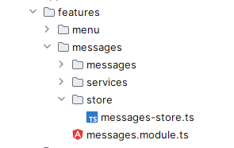
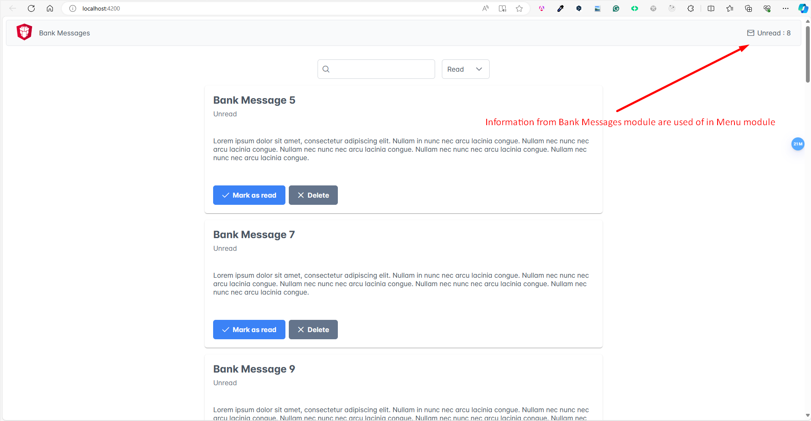

# NgRx Signals - BankMessages demo application

### NgRx Signal store.

Each module in the application can have its own store, which is responsible for storing the state of that module. 



This allows us to easily reproduce the last state of the entire application, and we can also easily utilize information from one module in another module.

First, we need to initialize the state, which is similar to the ViewModel of the given module. All properties in the MessageState will become signals.

```typescript
interface MessageState {
  messages: BankMessage[];
  sorting: Sorting;
  filterQuery: string;
  showSpinner: boolean;
}

export const initialState: MessageState = {
  messages: [],
  sorting: {value: 'Read'},
  filterQuery: '',
  showSpinner: false
};
```
Next, we create a store that we will be able to inject into every component where information about the state of a given module is needed:

```typescript
@Injectable({
  providedIn: 'root'
})
export class MessagesStore extends signalStore(withState(initialState)) {
}
```

In the store, we can also create **computed signal** properties:

```typescript
unreadMessages = computed(() => this.messages().filter(m => !m.isRead).length);
```

And also methods/actions that will be responsible for invoking business logic and updating the store by using the **patchState** method:

```typescript
  loadMessages = rxMethod<void>(
    pipe(
      takeUntilDestroyed(),
      tap(() => patchState(this, {showSpinner: true})),
      exhaustMap(() => {
        return this.messagesService.getMessages().pipe(
          tapResponse({
            next: (messages) => {
              const sortedMessages = this.messagesService.sortMessages(messages, this.sorting().value)
              patchState(this, {messages: sortedMessages, showSpinner: false})
            },
            error: (error) => {
              console.log(error);
              patchState(this, {showSpinner: false})
            }
          }),
        )
      })
    )
  );

  markAsRead(messageId: number) {
    const updatedMessages = this.messagesService.markAsRead(messageId, this.filterQuery(), this.sorting().value);
    patchState(this, {messages: updatedMessages});
  }

  deleteMessage(messageId: number) {
    const updatedMessages = this.messagesService.deleteMessage(messageId, this.filterQuery(), this.sorting().value);
    patchState(this, {messages: updatedMessages});
  }

  changeSorting(sorting: Sorting) {
    patchState(this, {sorting, showSpinner: true});
    const sortedMessages = this.messagesService.sortMessages(this.messages(), this.sorting().value);
    patchState(this, {messages: sortedMessages, showSpinner: false});
  }

  filterMessages(filterQuery: string) {
    patchState(this, {filterQuery});
    const filteredMessages = this.messagesService.filterMessages(filterQuery, this.sorting().value);
    patchState(this, {messages: filteredMessages});
  }
```
### Bussiness logic

Single responsibility of the store is update a state of the store (SRP principle). The entire business logic is located in a separate service, making it very easy to test.

```typescript
import { Injectable } from '@angular/core';
import {delay, of, tap} from "rxjs";
import { bankMessages } from '../../../shared/model/mock-data';
import {BankMessage, SortingOption} from '../../../shared/model/types';

@Injectable({
  providedIn: 'root'
})
export class MessagesService {
  private tmpMessages: BankMessage[] = [];

  getMessages() {
    return of(bankMessages).pipe(
      delay(1000),
      tap(messages => this.setTemporaryMessages(messages)),
    );
  }

  filterMessages(filterQuery: string, sorting: string): BankMessage[] {
    if (filterQuery.trim() === '' && this.tmpMessages.length > 0) {
      return this.sortMessages(this.tmpMessages, sorting);
    }

    const filteredMessages = this.tmpMessages.filter(m => m.title.toLowerCase().includes(filterQuery.toLowerCase()));

    return this.sortMessages(filteredMessages, sorting);
  }

  sortMessages(bankMessages: BankMessage[], sorting: string): BankMessage[] {
    return bankMessages.sort((a, b) => {
      if (sorting === SortingOption.Read) {
        return a.isRead === b.isRead ? 0 : a.isRead ? 1 : -1;
      } else {
        return a.isRead === b.isRead ? 0 : a.isRead ? -1 : 1;
      }
    });
  }

  markAsRead(messageId: number, filterQuery: string, sorting: string): BankMessage[] {
    const newMessages =  this.tmpMessages.map(m => m.id === messageId ? {...m, isRead: true} : m);
    this.setTemporaryMessages(newMessages);
    const filteredMessages = this.filterMessages(filterQuery, sorting);

    return filteredMessages;
  }

  deleteMessage(messageId: number, filterQuery: string, sorting: string): BankMessage[] {
    const newMessages =  this.tmpMessages.filter(m => m.id !== messageId);
    this.setTemporaryMessages(newMessages);
    const filteredMessages = this.filterMessages(filterQuery, sorting)

    return filteredMessages;
  }

  private setTemporaryMessages(messages: BankMessage[]) {
      this.tmpMessages = messages;
  }
}
```
### Components

The components are "pure" and practically contain no business logic. They only call methods/actions from the store. Thanks to this, testing components is much simpler.

```typescript
import {ChangeDetectionStrategy, Component, OnInit} from '@angular/core';
import {DropdownChangeEvent} from "primeng/dropdown";
import {Sorting} from '../../../shared/model/types';
import {MessagesStore} from '../store/messages-store';

@Component({
  selector: 'bm-messages',
  templateUrl: './messages.component.html',
  styleUrl: './messages.component.css',
  changeDetection: ChangeDetectionStrategy.OnPush
})
export class MessagesComponent implements OnInit {
  sortingOptions: Sorting[] = [
    {value: 'Read'},
    {value: 'Unread'},
  ];

  constructor(public store: MessagesStore) {
  }

  ngOnInit(): void {
    this.store.loadMessages();
  }

  public onSortingChange(event: DropdownChangeEvent) {
    this.store.changeSorting(event.value as Sorting);
  }

  public onFilterQueryChanged(query: string) {
    this.store.filterMessages(query);
  }
}
```

```typescript
import {ChangeDetectionStrategy, Component, input} from '@angular/core';
import {BankMessage} from '../../../../shared/model/types';
import { MessagesStore } from '../../store/messages-store';

@Component({
  selector: 'bm-message',
  templateUrl: './message.component.html',
  styleUrl: './message.component.css',
  changeDetection: ChangeDetectionStrategy.OnPush
})
export class MessageComponent {
  message = input.required<BankMessage>();

  constructor(private store: MessagesStore) {
  }

  public onMarkAsRead(id: number) {
    this.store.markAsRead(id);
  }

  public onDelete(id: number) {
    this.store.deleteMessage(id);
  }
}
```

### Communication between modules

The store also facilitates communication between modules. If information from another module is needed in one module, simply injecting the store and retrieving the desired information



```typescript
import {ChangeDetectionStrategy, Component, computed} from '@angular/core';
import {MenuItem} from "primeng/api";
import { MessagesStore } from '../../messages/store/messages-store';

@Component({
  selector: 'bm-main-menu',
  templateUrl: './main-menu.component.html',
  styleUrl: './main-menu.component.css',
  changeDetection: ChangeDetectionStrategy.OnPush
})
export class MainMenuComponent {
  menuItems: MenuItem[] = [{label: 'Bank Messages'}];

  constructor(public store: MessagesStore) {
  }
}

```
```html
  <ng-template pTemplate="end">
    <div class="unread-messages">
      <i class="pi pi-fw pi-envelope"></i>
      <span>Unread : {{ store.unreadMessages() }}</span>
    </div>
  </ng-template>
```
### Summing up:

Advantages of using NgRx Signals Store:

- Very easy signal management using the patchState method
- Separation of business logic
- Clean components
- Testability
- Easy communication between modules
